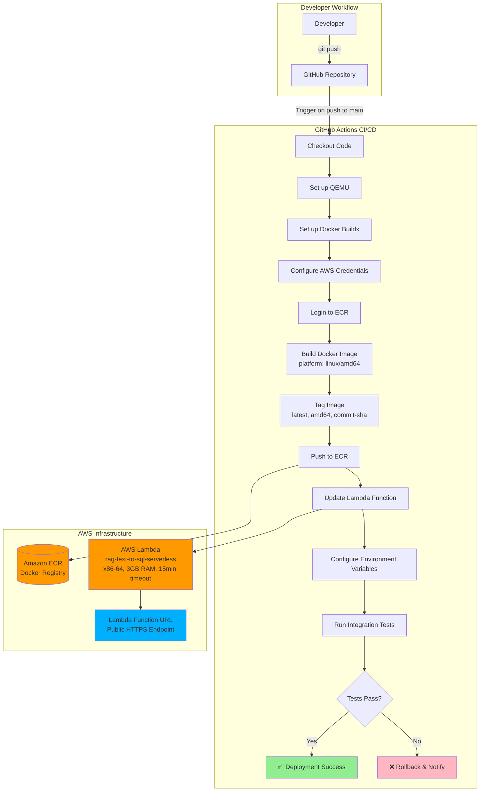
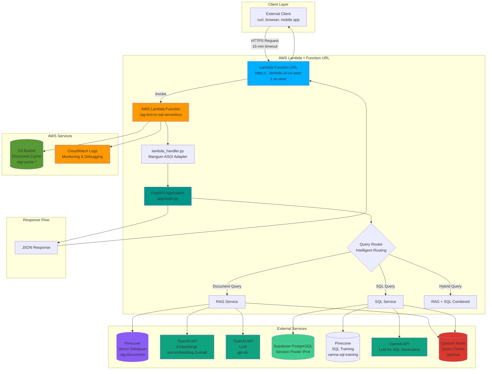
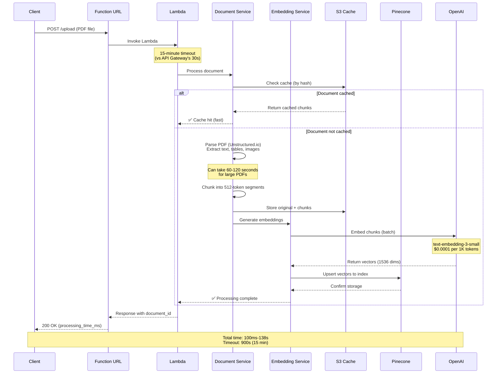
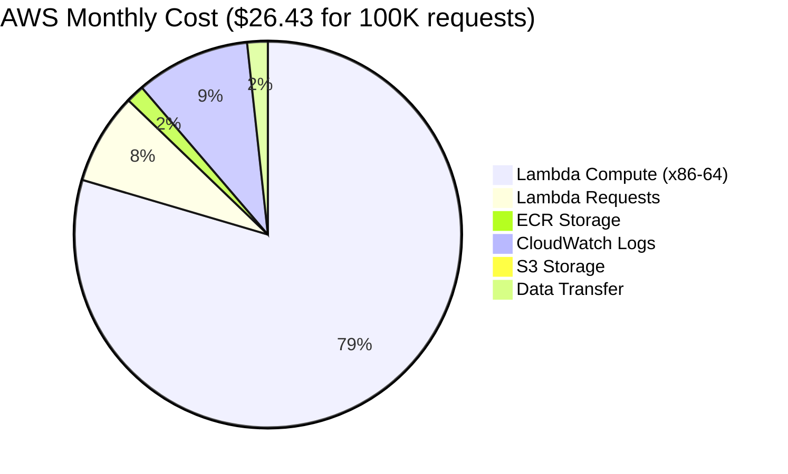
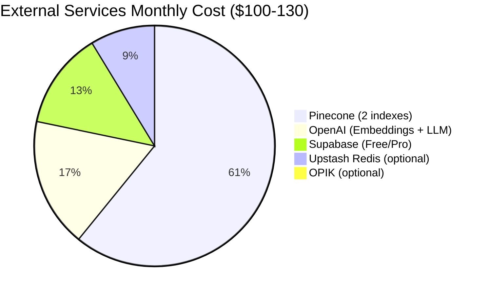
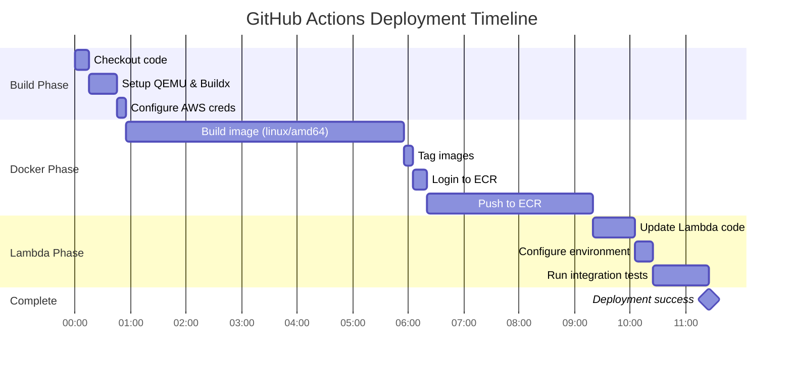
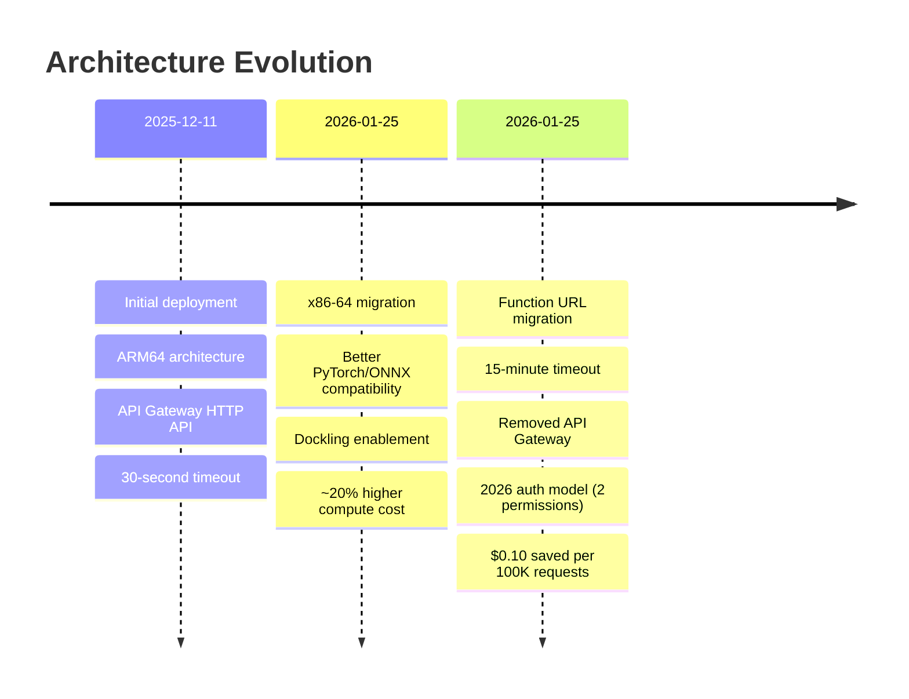

# AWS Lambda Deployment Architecture - Mermaid Diagrams

**Project:** Multi-Source RAG + Text-to-SQL System
**Architecture:** AWS Lambda (x86-64) + Function URL + ECR + S3
**Last Updated:** 2026-01-25
**Deployment Method:** GitHub Actions CI/CD

---

## 1. CI/CD Deployment Flow

This diagram shows the automated deployment pipeline from code push to production.



---

## 2. Runtime Architecture & Request Flow

This diagram shows how requests flow through the system at runtime.



---

## 3. Document Upload Flow (Long-Running Process)

This diagram shows the document processing pipeline that benefits from the 15-minute timeout.



---

## 4. Query Routing & RAG Flow

This diagram shows how queries are intelligently routed and processed.

```mermaid
graph LR
    subgraph "Request Entry"
        User[User Query] -->|POST /query| Lambda[Lambda Function]
    end

    subgraph "Query Analysis"
        Lambda --> Router{Query Router<br/>Keyword Analysis}
        Router -->|SQL keywords<br/>COUNT, SUM, AVG, etc.| TypeSQL[Query Type: SQL]
        Router -->|Document keywords<br/>policy, explain, what is| TypeDoc[Query Type: DOCUMENTS]
        Router -->|Mixed keywords<br/>show sales + explain policy| TypeHybrid[Query Type: HYBRID]
    end

    subgraph "SQL Pipeline"
        TypeSQL --> Vanna[Vanna.ai<br/>Text-to-SQL]
        Vanna --> VannaTrain[(Pinecone<br/>SQL Training Index)]
        Vanna --> GenSQL[Generate SQL Query]
        GenSQL --> Approval{Auto-approve?}
        Approval -->|Yes| ExecSQL[Execute on Supabase]
        Approval -->|No| Pending[Store in pending queue]
        ExecSQL --> SQLResult[SQL Results]
    end

    subgraph "Document Pipeline"
        TypeDoc --> EmbedQuery[Embed Query<br/>OpenAI]
        EmbedQuery --> SearchVectors[Search Pinecone<br/>rag-documents index]
        SearchVectors --> TopK[Retrieve top-k chunks<br/>similarity > threshold]
        TopK --> GenerateAnswer[Generate Answer<br/>GPT-4 + Context]
        GenerateAnswer --> DocResult[RAG Answer + Sources]
    end

    subgraph "Hybrid Pipeline"
        TypeHybrid --> ParallelSplit[Split Query]
        ParallelSplit --> SQLPart[SQL Component]
        ParallelSplit --> DocPart[Document Component]
        SQLPart --> SQLResult
        DocPart --> DocResult
        SQLResult --> Combine[Combine Results]
        DocResult --> Combine
        Combine --> HybridResult[Hybrid Response]
    end

    subgraph "Response"
        SQLResult --> Response[JSON Response]
        DocResult --> Response
        HybridResult --> Response
        Response --> User
    end

    style TypeSQL fill:#FFD700
    style TypeDoc fill:#87CEEB
    style TypeHybrid fill:#DDA0DD
    style Response fill:#90EE90
```

---

## 5. Infrastructure Components & Dependencies

This diagram shows all AWS and external services used.

```mermaid
graph TB
    subgraph "AWS Core Services"
        Lambda[AWS Lambda<br/>rag-text-to-sql-serverless<br/>x86-64, 3GB RAM, 15min timeout]
        ECR[Amazon ECR<br/>rag-text-to-sql<br/>Docker image storage]
        S3[Amazon S3<br/>rag-cache-{account-id}<br/>Document cache]
        CloudWatch[CloudWatch Logs<br/>/aws/lambda/rag-text-to-sql-serverless<br/>Monitoring]
        FunctionURL[Lambda Function URL<br/>Public HTTPS endpoint<br/>No API Gateway]
    end

    subgraph "IAM Security"
        IAMRole[IAM Role<br/>rag-lambda-execution-role]
        IAMPolicy1[Lambda Basic Execution]
        IAMPolicy2[S3 Access Policy]
        IAMRole --> IAMPolicy1
        IAMRole --> IAMPolicy2
        Lambda -.->|assumes| IAMRole
    end

    subgraph "External Vector Storage"
        Pinecone1[(Pinecone Index<br/>rag-documents<br/>dim=1536, cosine)]
        Pinecone2[(Pinecone Index<br/>vanna-sql-training<br/>dim=1536, cosine)]
    end

    subgraph "External Databases"
        Supabase[(Supabase PostgreSQL<br/>Session Pooler IPv4<br/>e-commerce schema)]
    end

    subgraph "External AI Services"
        OpenAI[OpenAI API<br/>Embeddings + GPT-4o]
    end

    subgraph "Optional Services"
        Redis[(Upstash Redis<br/>Query cache)]
        OPIK[OPIK Monitoring<br/>LLM observability]
    end

    Lambda --> FunctionURL
    Lambda --> ECR
    Lambda --> S3
    Lambda --> CloudWatch
    Lambda --> Pinecone1
    Lambda --> Pinecone2
    Lambda --> Supabase
    Lambda --> OpenAI
    Lambda -.->|optional| Redis
    Lambda -.->|optional| OPIK

    style Lambda fill:#FF9900
    style FunctionURL fill:#00B0FF
    style ECR fill:#FF9900
    style S3 fill:#569A31
    style CloudWatch fill:#FF9900
    style Pinecone1 fill:#8B5CF6
    style Pinecone2 fill:#8B5CF6
    style Supabase fill:#3ECF8E
    style OpenAI fill:#10A37F
    style Redis fill:#DC382D
    style OPIK fill:#FF6B6B
```

---

## 6. Cost Breakdown (Monthly Estimate)





---

## 7. Deployment Timeline



**Total deployment time:** ~10-12 minutes (first deployment)
**Subsequent deployments:** ~5-8 minutes (with Docker layer caching)

---

## 8. Key Architecture Benefits

| Feature | Value | Benefit |
|---------|-------|---------|
| **Timeout** | 15 minutes (900s) | ✅ Handles large PDF processing (138s observed) |
| **No API Gateway** | $0 extra cost | ✅ Saves $0.10 per 100K requests |
| **x86-64 Architecture** | AMD64 | ✅ Stable PyTorch/ONNX, Dockling support |
| **Function URL** | Direct HTTPS access | ✅ Simpler architecture, fewer services |
| **S3 Cache** | Hash-based caching | ✅ Fast repeated uploads (cache_hit: true) |
| **Auto-scaling** | Lambda auto-scales | ✅ Handles traffic spikes automatically |
| **Container Image** | Docker via ECR | ✅ Full control over dependencies |

---

## 9. 2026 Architecture Updates



---

## Technical Specifications

### Lambda Configuration
- **Function Name:** `rag-text-to-sql-serverless`
- **Architecture:** x86-64 (AMD64)
- **Memory:** 3008 MB (3 GB)
- **Timeout:** 900 seconds (15 minutes)
- **Ephemeral Storage:** 10 GB (/tmp)
- **Runtime:** Container (Python 3.12)
- **Handler:** `lambda_handler.handler`

### Function URL Configuration
- **Auth Type:** NONE (public access)
- **CORS:** Allow all origins, methods, headers
- **Invoke Mode:** BUFFERED (wait for full response)
- **Permissions Required (2026):**
  - `lambda:InvokeFunctionUrl`
  - `lambda:InvokeFunction`

### Docker Image
- **Base Image:** `public.ecr.aws/lambda/python:3.12`
- **Platform:** linux/amd64
- **Size:** ~3.6 GB (optimized with multi-stage build)
- **Builder:** Docker Buildx with UV package manager
- **Tags:** `latest`, `amd64`, `{commit-sha}`

### Environment Variables
- `OPENAI_API_KEY` - OpenAI API key
- `PINECONE_API_KEY` - Pinecone API key
- `PINECONE_ENVIRONMENT` - us-east-1-aws
- `PINECONE_INDEX_NAME` - rag-documents
- `DATABASE_URL` - Supabase Session Pooler (IPv4)
- `S3_CACHE_BUCKET` - rag-cache-{account-id}
- `USE_DOCKLING` - true (x86-64 benefit)
- `STORAGE_BACKEND` - s3

---

## Quick Reference

### Test Endpoints
```bash
# Health check
curl "https://YOUR-FUNCTION-URL.lambda-url.us-east-1.on.aws/health"

# Upload document
curl -X POST "https://YOUR-FUNCTION-URL.lambda-url.us-east-1.on.aws/upload" \
  -F "file=@document.pdf"

# Query documents
curl -X POST "https://YOUR-FUNCTION-URL.lambda-url.us-east-1.on.aws/query" \
  -H "Content-Type: application/json" \
  -d '{"query": "What is the return policy?"}'
```

### Monitoring
```bash
# View logs
aws logs tail /aws/lambda/rag-text-to-sql-serverless --follow

# Check function status
aws lambda get-function --function-name rag-text-to-sql-serverless

# Get Function URL
aws lambda get-function-url-config --function-name rag-text-to-sql-serverless
```

### Deployment
```bash
# Trigger deployment
git push origin main

# Monitor in GitHub Actions
# https://github.com/YOUR-USERNAME/YOUR-REPO/actions
```

---

**Document Created:** 2026-01-25
**Architecture:** AWS Lambda (x86-64) + Function URL + ECR + S3
**Total Monthly Cost:** ~$125-157 (100K requests/month)
**Key Advantage:** 15-minute timeout for large PDF processing
